# YouTube-Video-Data-Analytics

Youtube, the world-famous content sharing platform maintains a list of the most trending videos which keeps updating everyday. Many videos of many dif erent categories are published every minute. It maintains a track of user interactions(number of views, shares, comments and likes) with every video. We utilized that available data for this project, performing a detailed analysis on the trending videos.

The data we used for analysis is taken from kaggle
It comprises around 2 lakh trending videos, likes, dislikes, categories for 6 different regions 
 - Canada
 - France
 - India
 - USA
 - United Kingdom
 - Denmark

We analyzed this data to get insights of YouTube trending videos, to see what is common between these trends. Machine learning methods like Ensemble learning have been used to predict the essential missing data.These insights might also be used by people who want to increase the popularity of their videos on YouTube or just by the people who want to surf through stats of their favorite creator. And a bit of Sentiment Analysis to find polarities.

<h4>
<b>I. WORK DONE</b>
</h4>
<h5>
<b>1.1. DATA EXPLORATION AND CLEANING</b>
</h5>
Our dataset comprises data of 6 different countries
[India, USA, Denmark, Canada, France, Great Britain].
After loading the data (in csv format) we extracted
category names from another source. We came across
missing data(In category attribute) for a few titles, which
might contain considerable weight in analysis. So we
implemented a ML model for predicting the missing data.
We cleaned the attributes which were unnecessary for
analysis using pandas tools. We created individual
dataframe for each country and also a cumulative
dataframe. Analysis has been done on data of 6 different
countries, i.e India,U.S.A, France, Great Britain,
Denmark, Canada. The insights are gathered collectively
on all 6 countries data.

<h5>
<b>1.2. MODEL</b>
</h5>
Around 600+ missing values were observed in the
‘Category’ attribute, some of which could be important in
analysing user interactions. To be able to predict these
missing categories, a Machine Learning model which uses
ensemble learning has been implemented. The reason to
choose ensemble methods is that individual classifiers
perform poorly on testing data. The below table shows the
results about performance of different classifiers and their
accuracy in predicting the categories.

<h5>
<b>1.3 . VISUALISATION</b>
</h5>
<h5>
<b>1.3.1 . AN ALYSIS ON IN DIVIDUAL COUNTRY [INDIA]</b>
</h5>

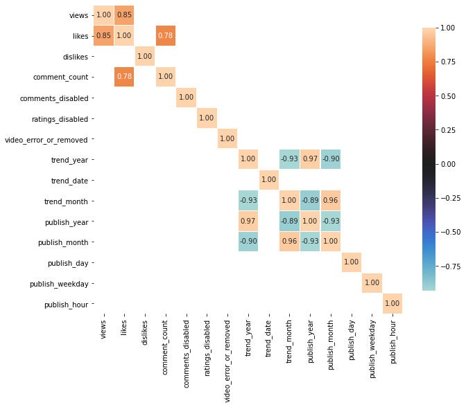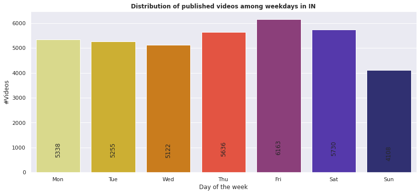
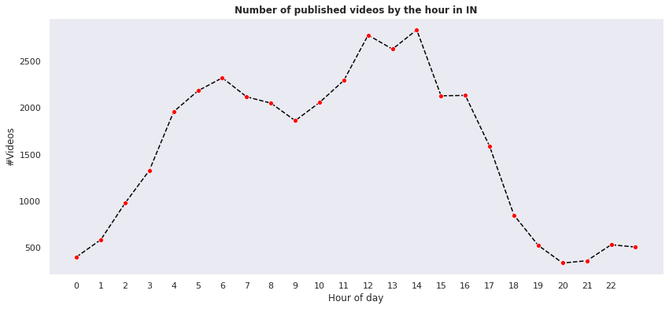 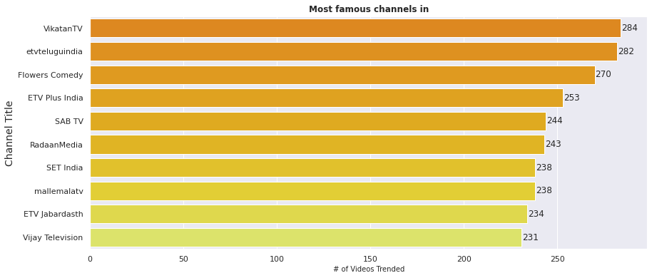

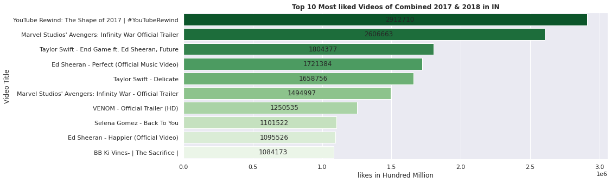 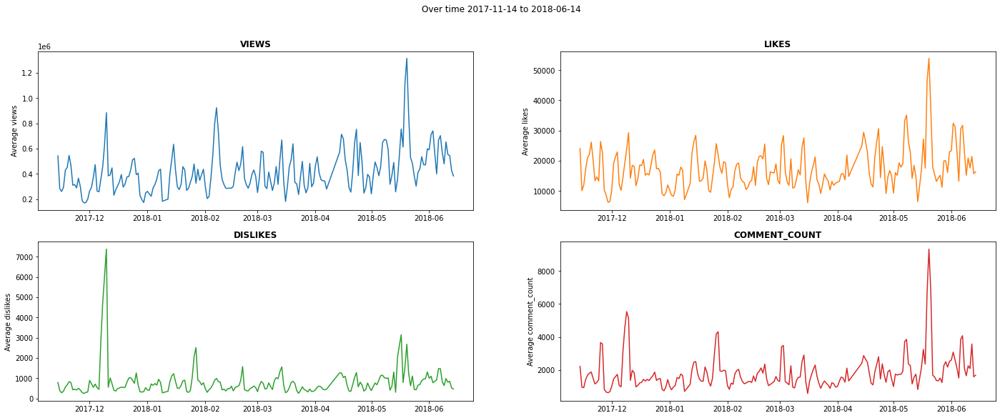

<h5>
<b>1.3.2. ANALYSIS ON CUMULATIVE DATA</b>
</h5>

 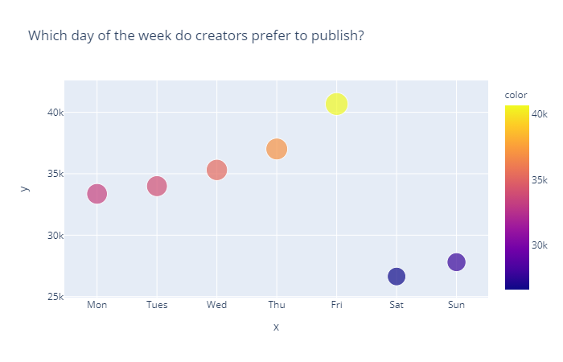
 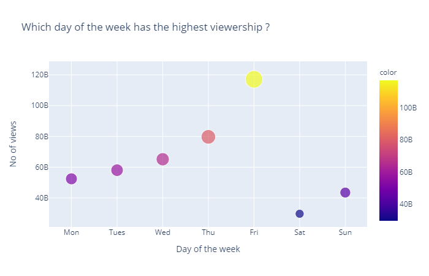

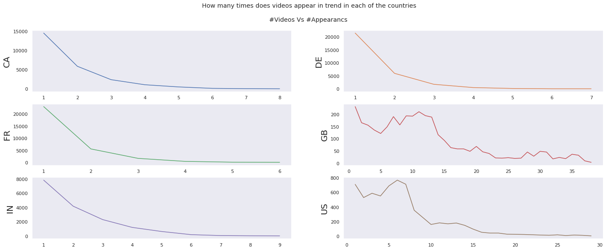 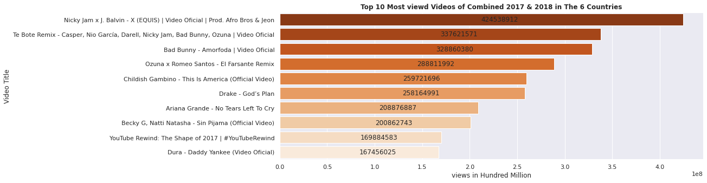
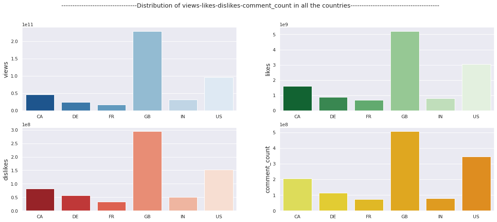 
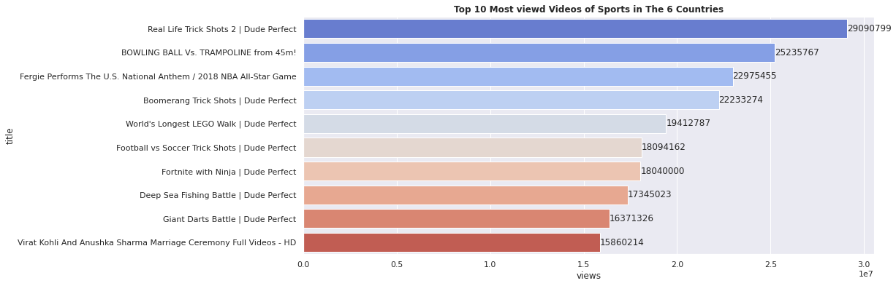 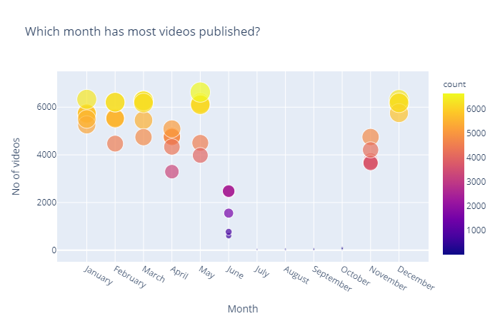

<h4>
<b>II. POSSIBLE INSIGHTS</b>
</h4>
1. In four of six countries[IN,FR,DE,CA] the median
number of days for a published video to be
trended is around 1 to 2 days. While the other two
countries, US and GB have 6,12 days
respectively.

2. Month has no effect on the video that is being
published, it varies from country to country and in
India, most number of videos are posted in the
month of June.

3. There isn’t any effect of weekends on the number
of videos published, but it has been a common
trend that the highest number of videos have been
published on Friday in any of the six countries.

4. Time of posting in a day seems to be very
important for publishing. From our analysis it has
been observed that most number of videos are
being posted between 13:00 to 16:00 hrs for all
the countries.

5. Here, India had the most viewership around 13:00
and all the other countries had the most
viewership from around 4:00 to 5:00 hrs of the
day. The possible reason might be the time zone
differences. As all the other countries are westrern
parts, they have a common time zone, thus
leading to a common result.

6. We came to a conclusion that the videos which
have more views are also observed to have more
likes and dislikes.They are positively correlated.
The same thing is valid even for videos of a
particular category in all the countries.

7. The top 5 channels in any category also have the
top 5 viewership, likes and dislikes in most of the
cases.

8. ‘Entertainment’ has been the most famous
category in all the 6 countries.

9. Different countries have a different trend in how
long a video trends. The United Kingdom has a
longest trend duration of 35 days.

10. Friday has also the highest viewership among
weekdays.
