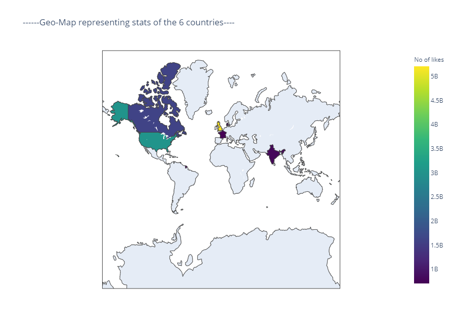

# YouTube-Video-Data-Analytics

Youtube, the world-famous content sharing platform maintains a list of the most trending videos which keeps updating everyday. Many videos of many dif erent categories are published every minute. It maintains a track of user interactions(number of views, shares, comments and likes) with every video. We utilized that available data for this project, performing a detailed analysis on the trending videos.

The data we used for analysis is taken from kaggle
It comprises around 2 lakh trending videos, likes, dislikes, categories for 6 different regions 
 - Canada
 - France
 - India
 - USA
 - United Kingdom
 - Denmark

We analyzed this data to get insights of YouTube trending videos, to see what is common between these trends. Machine learning methods like Ensemble learning have been used to predict the essential missing data.These insights might also be used by people who want to increase the popularity of their videos on YouTube or just by the people who want to surf through stats of their favorite creator. And a bit of Sentiment Analysis to find polarities.

<h4>
<b>I. WORK DONE</b>
</h4>
<h5>
<b>1.1. DATA EXPLORATION AND CLEANING</b>
</h5>
Our dataset comprises data of 6 different countries
[India, USA, Denmark, Canada, France, Great Britain].
After loading the data (in csv format) we extracted
category names from another source. We came across
missing data(In category attribute) for a few titles, which
might contain considerable weight in analysis. So we
implemented a ML model for predicting the missing data.
We cleaned the attributes which were unnecessary for
analysis using pandas tools. We created individual
dataframe for each country and also a cumulative
dataframe. Analysis has been done on data of 6 different
countries, i.e India,U.S.A, France, Great Britain,
Denmark, Canada. The insights are gathered collectively
on all 6 countries data.

<h5>
<b>1.2. MODEL</b>
</h5>
Around 600+ missing values were observed in the
‘Category’ attribute, some of which could be important in
analysing user interactions. To be able to predict these
missing categories, a Machine Learning model which uses
ensemble learning has been implemented. The reason to
choose ensemble methods is that individual classifiers
perform poorly on testing data. The below table shows the
results about performance of different classifiers and their
accuracy in predicting the categories.

<h5>
<b>1.3 . VISUALISATION</b>
</h5>
<h5>
<b>1.3.1 . AN ALYSIS ON IN DIVIDUAL COUNTRY [INDIA]</b>
</h5>

 

 

<h5>
<b>1.3.2. ANALYSIS ON CUMULATIVE DATA</b>
</h5>

 
 

 
 
 
